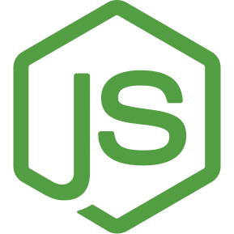
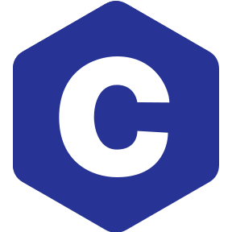
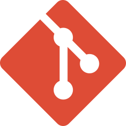
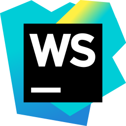

# Hi, I’m Helder Carvalho 👋

I'm finishing my Bachelor in Computer Systems Engineering and looking for a role of Web Developer.

👀 I like to watch series and movies, play video games, go out with friends and certainly more things that I don't
remember right now 😉.

💼 My public work is university projects, where the most important being the ones pinned below.

### 🌐 You can check me out on:

### 🛠 I've worked with:

[linkedin]: https://www.linkedin.com/in/heldermcarvalho/
